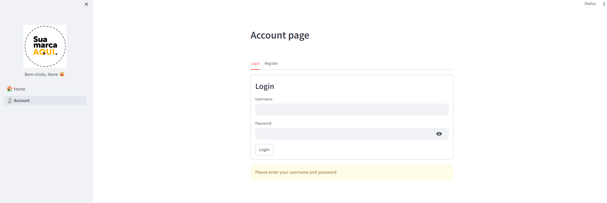

# Streamlit Authenticator Template

A brief description of what this project does and who it is for



## Authentication

User information is stored in the ```config.yaml``` file in this repository, where the configuration leads the user to acquire a role in the system.

This role is used in the ```/modules/nav.py``` file that manages the session through the streamlit-authenticator library. It is in this same file that you will release the permissions for more roles or the pages that each user can authenticate.

By default I created two users to make it easier to understand the template, these users should not be taken to a production environment.

```bash
  user: adminuser key: abc
  user: readonly key: abc
```


## Installation

Install streamlit libraries

```bash
  py -3 -m venv .venv
  pip install -r requirements.txt
```

Start the server

```bash
  streamlit run streamlit_app.py
```

## Reference

 - [Streamlit Documentation](https://docs.streamlit.io/)
 - [Streamlit Authenticator Documentation](https://blog.streamlit.io/streamlit-authenticator-part-1-adding-an-authentication-component-to-your-app/)

## Observations

This template is a technical guide to follow and even study (if necessary) how Python + Streamlit works. 

### The template is open source for everyone to enjoy and implement their idea on top of it as needed.
